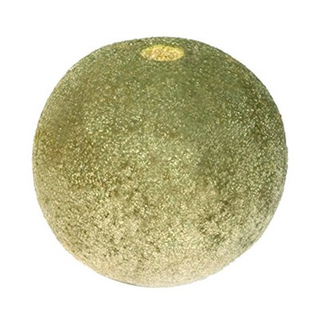

# Kodbel | | Another PHP MVC framework like Laravel
For educational purposes only right now.

----
## How to install

1. Clone the project using git
2. Create database schema
3. Create `.env` file from `.env.example` file and adjust database parameters
4. Run `composer install`
5. Run migrations by executing `php migrations.php` from the project root directory
6. Go to the `public` folder 
7. Start php server by running command `php -S 127.0.0.1:8080` 
8. Open in browser http://127.0.0.1:8080
